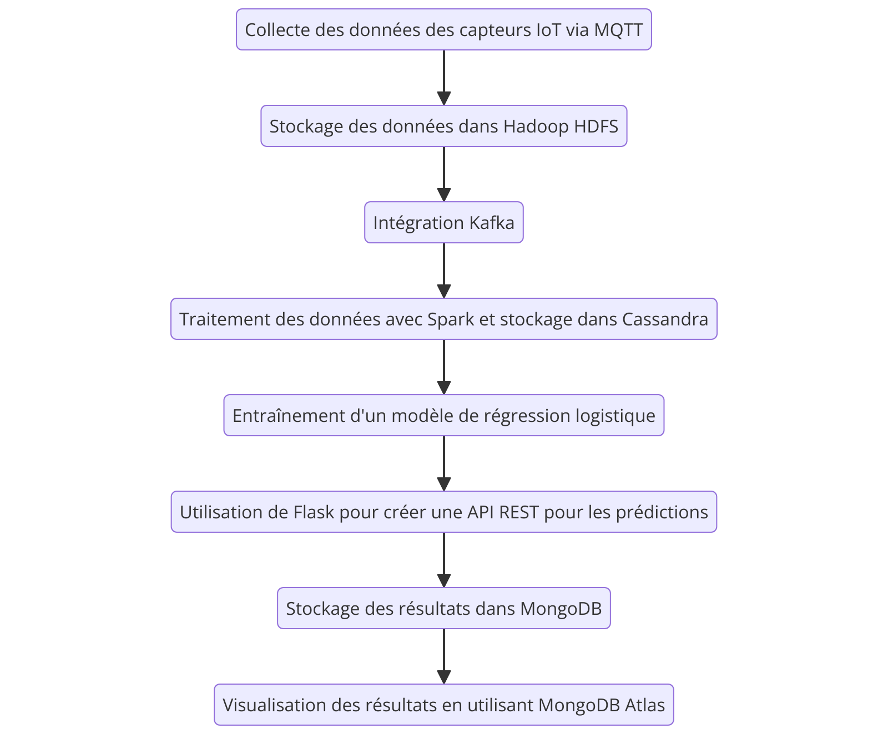
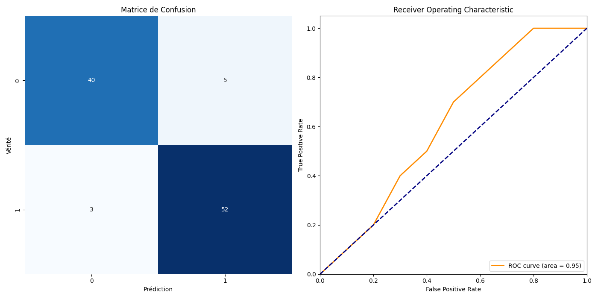

# Projet de Pipeline de Données pour la Maladie de Parkinson

Ce projet implémente un pipeline de traitement des données utilisant plusieurs technologies Big Data pour analyser les caractéristiques des patients atteints de la maladie de Parkinson. Le pipeline inclut les étapes de téléchargement des données, de chargement dans une base de données NoSQL (Cassandra), et de traitement des données avec une approche MapReduce.

## Table des Matières

1. [Introduction](#introduction)
2. [Prérequis](#prérequis)
3. [Installation](#installation)
4. [Téléchargement et Préparation des Données](#téléchargement-et-préparation-des-données)
5. [Entraînement du Modèle](#entraînement-du-modèle)
6. [API REST](#api-rest)
7. [Scripts de Pipeline](#scripts-de-pipeline)
8. [Exécution des Scripts](#exécution-des-scripts)
9. [Conclusion](#conclusion)

## Introduction

Ce projet est conçu pour traiter les caractéristiques des patients atteints de la maladie de Parkinson en utilisant un pipeline de traitement de données Big Data. Nous avons étudié et utilisé plusieurs technologies dont Kafka, Hadoop, Spark, Apache Cassandra, et MongoDB.

## Prérequis

- Python 3.6+
- Java 8 ou Java 11 (OpenJDK ou Oracle JDK)
- Hadoop
- Kafka
- Spark
- Cassandra
- MongoDB
- Flask
- Scikit-learn
- Mosquitto MQTT

## Installation

### Étape 1: Installation de Java

```bash
sudo apt update
sudo apt install openjdk-11-jdk
java -version
 ```
### Étape 2: Installation de Hadoop
wget https://downloads.apache.org/hadoop/common/hadoop-3.3.0/hadoop-3.3.0.tar.gz
tar -xvzf hadoop-3.3.0.tar.gz
sudo mv hadoop-3.3.0 /usr/local/hadoop

Configurer les variables d'environnement pour Hadoop dans ~/.bashrc :

bash

echo 'export HADOOP_HOME=/usr/local/hadoop' >> ~/.bashrc
echo 'export PATH=$PATH:$HADOOP_HOME/bin:$HADOOP_HOME/sbin' >> ~/.bashrc
source ~/.bashrc


### Étape 3: Installation de Kafka

ash

wget https://downloads.apache.org/kafka/2.7.0/kafka_2.13-2.7.0.tgz
tar -xvzf kafka_2.13-2.7.0.tgz
sudo mv kafka_2.13-2.7.0 /usr/local/kafka

Configurer les variables d'environnement pour Kafka dans ~/.bashrc :

bash

echo 'export KAFKA_HOME=/usr/local/kafka' >> ~/.bashrc
echo 'export PATH=$PATH:$KAFKA_HOME/bin' >> ~/.bashrc
source ~/.bashrc

### Étape 4: Installation de Spark

wget https://downloads.apache.org/spark/spark-3.1.1/spark-3.1.1-bin-hadoop3.2.tgz
tar -xvzf spark-3.1.1-bin-hadoop3.2.tgz
sudo mv spark-3.1.1-bin-hadoop3.2 /usr/local/spark

Configurer les variables d'environnement pour Spark dans ~/.bashrc :

bash

echo 'export SPARK_HOME=/usr/local/spark' >> ~/.bashrc
echo 'export PATH=$PATH:$SPARK_HOME/bin' >> ~/.bashrc
source ~/.bashrc

### Étape 5: Installation de Cassandra

bash
wget https://downloads.apache.org/cassandra/4.0.7/apache-cassandra-4.0.7-bin.tar.gz
tar -xvzf apache-cassandra-4.0.7-bin.tar.gz
sudo mv apache-cassandra-4.0.7 /opt/cassandra
echo 'export CASSANDRA_HOME=/opt/cassandra' >> ~/.bashrc
echo 'export PATH=$PATH=$CASSANDRA_HOME/bin' >> ~/.bashrc
source ~/.bashrc
cassandra -f

### Étape 6: Installation de MongoDB
wget -qO - https://www.mongodb.org/static/pgp/server-4.4.asc | sudo apt-key add -
echo "deb [ arch=amd64,arm64 ] https://repo.mongodb.org/apt/ubuntu bionic/mongodb-org/4.4 multiverse" | sudo tee /etc/apt/sources.list.d/mongodb-org-4.4.list
sudo apt update
sudo apt install -y mongodb-org
sudo systemctl start mongod
sudo systemctl enable mongod

### Étape 7: Installation de Flask et Scikit-learn
pip install flask flask-cors pandas numpy scikit-learn mlxtend


### Étape 8: Installation de Mosquitto MQTT
sudo apt-add-repository ppa:mosquitto-dev/mosquitto-ppa
sudo apt update
sudo apt install mosquitto mosquitto-clients
sudo systemctl enable mosquitto
sudo systemctl start mosquitto

## Exécution des Scripts

### Étape 1: Entraîner le modèle

```bash
python train_model.py
```

###  Étape 2: Lancer le serveur Flask

bash

python falsk_api_rest.py

### Étape 3: Exécuter les scripts de pipeline

Démarrer le script data_receiver.py pour recevoir les données et les stocker dans Hadoop :

bash

python data_receiver.py

Démarrer le script data_sender.py pour commencer à publier les données sur le broker MQTT :

bash

python data_sender.py

Démarrer le script hadoop_to_kafka.py pour envoyer les données de Hadoop à Kafka :

bash

python hadoop_to_kafka.py

Démarrer le script spark_processing.py pour traiter les données avec Spark et les stocker dans Cassandra :

bash

spark-submit spark_processing.py

Démarrer le script store_results_mongodb.py pour stocker les résultats de l'API dans MongoDB :

bash

python store_results_mongodb.py

## Résultats

Après avoir entraîné le modèle de régression logistique pour la détection de la maladie de Parkinson, nous avons généré deux graphiques pour évaluer les performances du modèle : une matrice de confusion et une courbe ROC.

### Matrice de Confusion

La matrice de confusion montre le nombre de vraies positives, vraies négatives, fausses positives et fausses négatives dans les prédictions du modèle.



### Courbe ROC

La courbe ROC (Receiver Operating Characteristic) illustre la performance du modèle en termes de taux de vrais positifs et de taux de faux positifs. L'aire sous la courbe (AUC) est un indicateur de la capacité du modèle à distinguer entre les classes.


### Métriques de Performance

- **Accuracy**: 0.92
- **Precision**: 0.91
- **Recall**: 0.95
- **F1 Score**: 0.93
- **ROC AUC Score**: 0.95

### Instructions pour Générer les Graphiques

Pour générer ces graphiques, suivez les étapes ci-dessous :

1. **Installer les dépendances** :

   ```bash
   pip install matplotlib seaborn
